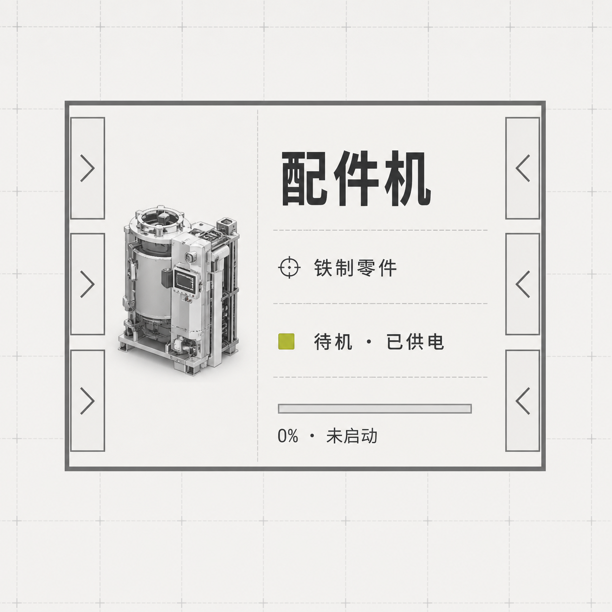

# 视觉参考基线

当前视觉基线来自用户于 2026-08-07 提供的《明日方舟：终末地》游戏内“编辑蓝图 / 蓝图预览”截图。

必须保持：

- 浅灰纸面和低对比度正方网格。
- 设备使用黑色外框、浅灰面板、灰阶图标和贴边端口。
- 传送带为接近单格宽度的黄色宽带，转角具有清楚的圆角，带内重复显示深灰方向箭头。
- 管道与传送带具有同等清晰的占地宽度，但用灰色管体区分。
- 管道比传送带略窄，并根据内容改变填充色：清水为蓝色、液化息壤为青绿色、污水为棕灰色；内容颜色属于数据状态而非装饰效果。
- 方向箭头保持静止，只作为流向标记；运行状态仅移动匹配带宽的物品图标，不使用霓虹、外发光、玻璃拟态或装饰性投影。
- 转角箭头使用进入方向和输出方向的 45° 中间角，避免在弯道上仍显示水平或垂直箭头。
- 画布格子不使用鼠标悬停方框；只有显式 `X` 选择的实体显示选择边界。

模拟器额外叠加的信息包括配方、生产/等待/阻塞状态、物品产出/消耗双折线和模拟时钟，但这些信息不得破坏蓝图本体的可读性。右侧设备状态卡复用底部目录的设备缩略图来源与框体语言；界面只保留浅色蓝图主题。

设备轮盘属于短暂操作层，不模仿科幻发光材质：使用半透明深灰圆环、细边框和项目既有黄绿色状态色。只允许当前方向选项短促闪烁确认，随后立即消失。传送带实时预览沿用正式宽带几何，以较浅描边和终点圆标区分未提交状态。

## 设备卡片排版基准

- 输入/输出口使用设备框内部的固定窄边栏，内容区必须为四周端口留出安全距离。
- 设备内容采用“左侧缩略图 + 右侧信息”的固定分栏；右侧依次只显示设备名、当前配方、工作/供电状态和处理进度。
- 正常状态不重复显示“物流通畅”等低价值文案；输入阻塞、输出阻塞、断电等异常信息优先覆盖普通状态。
- 信息必须保持单行并在空间不足时截断，不允许跨越图片区、端口栏或边框。
- 按实际可视单元格尺寸自动切换完整、紧凑、极简三档：紧凑档弱化进度文字，极简档只保留缩略图、设备名和状态色。
